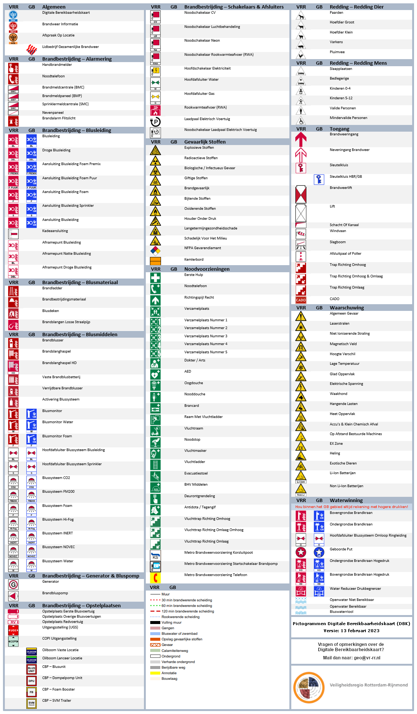

# VRR OIV project

## Handleiding voor eindgebruikers

Klik op onderstaande link om naar de gebruikershandleiding te gaan.
Hierin vind je de instructies om het programma te installeren en te gebruiken.

[Documentatie (in ontwikkeling)](https://vr-rr.github.io/vrr-oiv/)

## Over het project

VRR OIV (operationele informatievoorziening) is een onderdeel van het VRR GIS-applicatielandschap. Binnen de geo-informatieketen vormt VRR OIV een bron voor onder andere het KaartViewer geoportaal en de MOI.  

VRR OIV zelf is opgebouwd uit een aantal onderdelen: een QGIS project met kaartlagen en tekenmogelijkheden, PostGIS database definities en Geoserver kaartlagen met bijbehorende opmaak en definities. 

Vanuit QGIS wordt middels een WFS-T (GeoJSON) verbinding gecommuniceerd met de database. De database gegevens worden vervolgens door de Geoserver weer vertaald in een kaartlaag die via services (WFS/WMS) bevraagbaar is in afnemende applicaties. Middels de ETL-koppeling is het ook mogelijk om gegevens en metadata te bevragen in dashboards.

