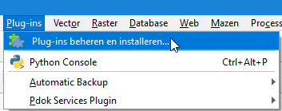
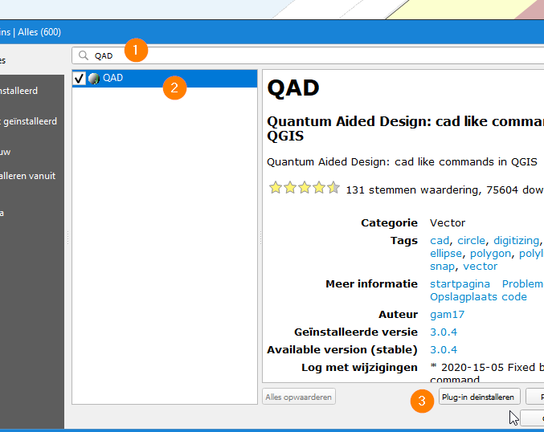

# Installatie door ServiceDesk

Voor het gebruik van QGIS als tekentool dient de laatste LTR versie 64-bits versie van QGIS te worden geïnstalleerd. Op dit moment 3.16.0. 

Download de installer en installeer hem via de ServiceDesk.

[Download QGIS](https://qgis.org/nl/site/forusers/download.html)

Verdere instellingen kunnen worden gedaan zonder tussenkomst van de ServiceDesk.

# QGIS voorbereiden op het eerste gebruik

Na het opstarten van QGIS voor de eerste keer is het nodig om een aantal plugins te installeren zodat het tekenen optimaal kan verlopen.

1. Klik op *Plug-ins beheren en installeren*:

2. Installeer de plug-in *QAD*:

Zoek naar QAD (1), kies QAD (2) en klik op installeren (3):

# QGIS opstarten om te tekenen

Start QGIS op door het openen van het VRR-OIV projectbestand.

Dubbelklik op het bestand:

`vrr_tekentool_oiv.qgz`