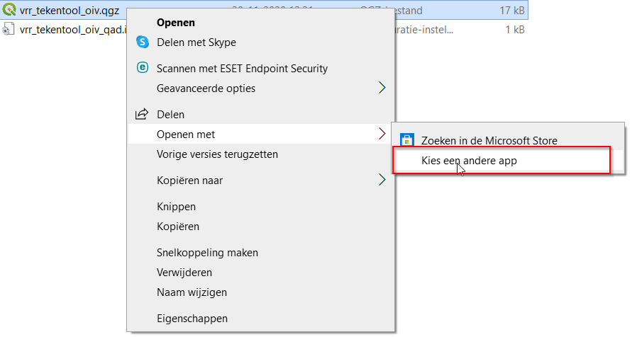

# Installatie door ServiceDesk

Voor het gebruik van QGIS als tekentool dient de laatste LTR (long-term release) versie 64-bits versie van QGIS te worden geïnstalleerd. Op dit moment 3.16.0. 

[Download de QGIS installer](https://qgis.org/nl/site/forusers/download.html) op je pc en laat QGIS vervolgens installeren door de ServiceDesk.

In de installatiewizard kunnen alle standaardinstellingen worden gebruikt, maar het is niet nodig om de voorbeelddatasets te installeren. Na afloop vind je op je bureaublad een snelkoppeling van de geïnstalleerde QGIS-versie.

Mocht je meerdere QGIS versies op je pc hebben staan dan kan het handig zijn om gelijk de oude versie te laten verwijderen van je pc. Anders zal het VRR OIV QGIS projectbestand mogelijk in een oudere of niet ondersteunde QGIS versie opstarten.

Verdere instellingen kunnen worden gedaan zonder tussenkomst van de ServiceDesk.

```note
## Openen met... instellen

Als er meerdere QGIS versies geïnstalleerd staan op de pc kan je handmatig de versie kiezen waarmee QGIS projectbestanden geopenend moeten worden.

1. Rechtermuisklik op een QGIS bestand (.qgz), bijvoorbeeld `vrr_tekentool_oiv.qgz`. Het is hierbij niet van belang om welk bestand het gaat. En kies voor **Openen met** > **Kies een andere app**.


2. Klik op **Meer apps** onderaan het lijstje en zet direct een vinkje voor **Altijd deze app gebruiken voor het openen van .qgz-bestanden**
3. Blader dan naar de installatie map en klik op qgis-bin.exe, bijvoorbeeld:
   *C:\Program Files\QGIS 3.16\bin\qgis-bin.exe*
```
****

# VRR OIV downloaden

VRR OIV is de naam voor het QGIS projectbestand wat is geconfigureerd voor het tekenen van bereikbaarheidskaarten. Het is een gezipte map die je via [deze link](https://github.com/VR-RR/vrr-oiv/zipball/main){:target="_blank"} kan downloaden. Sla het bestand ergens op in een tijdelijke locatie, bijvoorbeeld de downloadsmap. Daarna is het nodig om het ZIP-bestand uit te pakken naar een locatie van waaruit je met VRR OIV wil gaan werken. Dit kan bijvoorbeeld je bureaublad zijn zodat je VRR OIV altijd bij de hand hebt.

```note
## Updates van VRR OIV installeren

Soms komen er nieuwe functionaliteiten zoals iconen of lagen bij in het VRR OIV projectbestand. Volg dan eerder genoemde stappen (downloaden en unzippen) nog een keer en verwijder het oude mapje. De ingetekende gegevens blijven hierbij altijd bewaard.

```
****

# QGIS voorbereiden op het eerste gebruik door gebruiker

Om de verbindingen te kunnen maken met de database dient eenmalig bij het installeren van QGIS een bestand gekopieerd te worden naar de gebruikersmap.

```note
Bij het installeren van een nieuwe QGIS versie of het downloaden van een nieuwe VRR OIV update (projectbestand) kun je deze stap overslaan. Deze stap hoeft dus alleen gedaan te worden indien QGIS voor het eerst net geïnstalleerd is door de ServiceDesk.
```

De locatie van de gebruikersmap ziet er meestal zo uit: ```C:\Users\braggaar\AppData\Roaming\QGIS\QGIS3\profiles\default```


```tip
De locatie van de gebruikersmap kun je eventueel ook vinden vanuit QGIS via het menu **Extra** > **Gebruikersprofielen** > **Actieve profielmap openen**.


```

In deze map plaats je het bestand **qgis-auth.db** vanuit het release ZIP-bestand wat je hebt gedownload van Github in de stap hiervoor.


Bij het opstarten van QGIS voor de eerste keer wordt er dan gevraagd om een wachtwoord om de wachtwoordenkluis te ontgrendelen. Dit wachtwoord kun je opvragen bij een van de beheerders en is vanwege veiligheidsredenen niet online vindbaar.

# Extra's en plug-ins (optioneel indien gewenst)

Plug-ins zijn kleine uitbreidingen op QGIS die de gebruiker helpen bij het uitvoeren van specifieke taken.

1. Klik op *Plug-ins beheren en installeren*:


2. Installeer de plug-in *QAD*:

Zoek naar QAD (1), kies QAD (2) en klik op installeren (3):


# QGIS opstarten om te tekenen

Start QGIS op door het openen van het VRR-OIV projectbestand. Indien je de stappen van de handleiding exact hebt gevolgd staat dit bestand in een mapje op je bureaublad.

Dubbelklik op het bestand om het in QGIS te openen:

`vrr_tekentool_oiv.qgz`