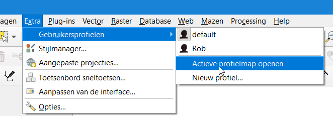

# Installatie door ServiceDesk

Voor het gebruik van QGIS als tekentool dient de laatste LTR (long-term release) versie 64-bits versie van QGIS te worden geïnstalleerd. Op dit moment 3.16.0. 

1. [Download de QGIS installer](https://qgis.org/nl/site/forusers/download.html) op je pc (kies voor **QGIS standalone installatiepakket**) en laat het QGIS installatiebestand vervolgens installeren door de ServiceDesk. 

   *In de installatiewizard kunnen alle standaard instellingen worden gebruikt, maar het is niet nodig om de voorbeelddatasets te installeren. Na afloop vind je op je bureaublad een snelkoppeling van de geïnstalleerde QGIS-versie.*

2. Mocht je meerdere QGIS versies op je pc hebben staan dan is het handig om gelijk de oude QGIS versie(s) door de ServiceDesk te laten verwijderen van je pc. Anders zal het VRR OIV QGIS projectbestand mogelijk in een oudere of niet ondersteunde QGIS versie opstarten.

Verdere installatie en instellingen hebben geen administrator rechten nodig en kunnen worden gedaan zonder tussenkomst van de ServiceDesk. 

```note
## Optioneel: Openen met... instellen

Als er meerdere QGIS versies geïnstalleerd staan op de pc kan je handmatig de versie kiezen waarmee QGIS projectbestanden geopenend moeten worden.

1. Rechtermuisklik op een QGIS bestand (.qgz), bijvoorbeeld `vrr_tekentool_oiv.qgz`. Het is hierbij niet van belang om welk bestand het gaat. En kies voor **Openen met** > **Kies een andere app**.


2. Klik op **Meer apps** onderaan het lijstje en zet direct een vinkje voor **Altijd deze app gebruiken voor het openen van .qgz-bestanden**
3. Blader dan naar de installatie map en klik op qgis-bin.exe, bijvoorbeeld:
   *C:\Program Files\QGIS 3.16\bin\qgis-bin.exe*
```
****

# VRR OIV downloaden

VRR OIV is de naam voor het QGIS projectbestand wat is geconfigureerd voor het tekenen van bereikbaarheidskaarten. 

1. Download de laatste release van VRR OIV via [deze link](https://github.com/VR-RR/vrr-oiv/zipball/main){:target="_blank"}. Sla het download bestand ergens op in een tijdelijke locatie, bijvoorbeeld de downloadsmap. 
2. Pak het ZIP-bestand uit naar een locatie van waaruit je met VRR OIV wil gaan werken. Dit kan bijvoorbeeld je bureaublad zijn zodat je VRR OIV altijd direct bij de hand hebt.
3. Voor nieuwe gebruikers: ga door naar **QGIS voorbereiden op het eerste gebruik door gebruiker**.


# QGIS voorbereiden op het eerste gebruik door gebruiker

Om de verbindingen te kunnen maken met de database dient eenmalig bij het installeren van QGIS een bestand gekopieerd te worden naar de gebruikersmap.

```note
Bij het installeren van een nieuwe QGIS versie of het downloaden van een nieuwe VRR OIV update (projectbestand) kun je deze stap overslaan. Deze stap hoeft dus alleen gedaan te worden indien QGIS voor het eerst net geïnstalleerd is door de ServiceDesk.
```

1. Vind de QGIS gebruikersmap. De locatie van de gebruikersmap ziet er meestal zo uit: ```C:\Users\braggaar\AppData\Roaming\QGIS\QGIS3\profiles\default```


```tip
De locatie van de gebruikersmap kun je ook vinden door QGIS op te starten en via het menu **Extra** > **Gebruikersprofielen** > **Actieve profielmap openen** de map te openen.


```

2. Plaats in deze map het bestand **qgis-auth.db** vanuit de release die je hebt gedownload van Github in de voorgaande stappen. De productie en de trainingsomgeving hebben een apart **qgis-auth.db** bestand. Kopiëer het juiste bestand en overschrijf een eventueel reeds aanwezig bestand.

3. Bij het opstarten van QGIS voor de eerste keer wordt er gevraagd om een wachtwoord om de wachtwoordenkluis te ontgrendelen. Dit wachtwoord kun je opvragen bij een van de beheerders en is vanwege veiligheidsredenen niet online vindbaar. Je kan het scherm gewoon sluiten en hier later weer terugkeren zodra je het wachtwoord hebt.

4. Stuur een mail naar geo@vr-rr.nl met de vermelding of het gaat om de trainingsomgeving of om de productie omgeving. Het wachtwoord wordt dan naar je werktelefoon of e-maail verstuurd.

# QGIS opstarten om te tekenen

Start QGIS op door het openen van het VRR-OIV projectbestand. Indien je de stappen van de handleiding exact hebt gevolgd staat dit bestand in een mapje op je bureaublad.

```danger
## ZIP-bestanden

Let op, open altijd het QGIS-project vanuit de **uitgepakte** map. Zit je nog in de **gezipte** map dan krijg je tijdens het openen van QGIS gerelateerde foutmeldingen. Sluit QGIS af en verwijder het .zip bestand. Werk alleen vanuit het uitgepakte mapje.

```
****

```note
## Updates van VRR OIV installeren

Soms komen er nieuwe functionaliteiten zoals iconen of lagen bij in het VRR OIV projectbestand. Volg dan eerder genoemde stappen (downloaden en unzippen) nog een keer en verwijder het oude mapje. De ingetekende gegevens blijven hierbij altijd bewaard.

```
****

Dubbelklik op het bestand om het in QGIS te openen:

`vrr_tekentool_oiv.qgz`

# Werken met plugins

## Installatie plugins

Plugins zijn kleine uitbreidingen op QGIS die de gebruiker helpen bij het uitvoeren van specifieke taken.
Soms is het nodig om een plugin bij te werken, te installeren of te verwijderen.

Installatie plugins:

1. Klik op *Plugins beheren en installeren*:


2. Zoek op de naam van de plugin via het zoekveld.

3. Klik in de resultaten op de gevonden plugin.

4. In het rechterpaneel opent de beschrijving van de plugin. Eronder worden knoppen getoond voor bijwerken installeren/deïnstalleren en activeren/deactiveren.


(1) zoekveld
(2) resultatenlijst
(3) installeerknop
