* TOC
{:toc}

# Tekenen in QGIS

QGIS werkt met net als andere GIS-systemen met lagen. Iedere laag bevat altijd 1 soort geometrie: punten, lijnen óf vlakken. Combinaties van geometrie soorten binnen 1 laag zijn dus niet mogelijk in GIS.

Om te kunnen tekenen (toevoegen, bewerken en verwijderen van data) in QGIS moet de laag op 'bewerkbaar' gezet worden.
Klik daarvoor eerst op de laag in het lagenoverzicht aan de linkerkant, bijvoorbeeld bouwlaag:

 en dan op het potlood in de werkbalk bovenin.

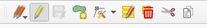

Voor de laagnaam verschijnt nu een potlood icoontje om aan te geven dat de laag bewerkbaar is. De huidig geselecteerde laag wordt verder aangeduid door een blauwe achtergrond bij klikken op de laag en een grijze achtergrond wanneer je op de kaart bezig bent maar wanneer de kaartlaag nog wel geselecteerd is.

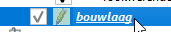

## Bouwlaag toevoegen

Een bouwlaag is een vloer in een gebouw. Een bouwlaag begint bij laag 1 (de begane grond). De eerste verdieping is bouwlaag 2, enz.

Een bouwlaag kan je zelf tekenen, of overnemen vanuit de BAG om tekenwerk te besparen.

### Bouwlaag zelf tekenen

Maak de kaartlaag **bouwlaag** bewerkbaar in het lagenoverzicht. 

Bepaal de vorm die je wil intekenen en kies uit de volgende opties:

Met het gereedschap **MPOLYGON** kan een polygoon (vlak) getekend worden bestaande uit verschillende vormen.

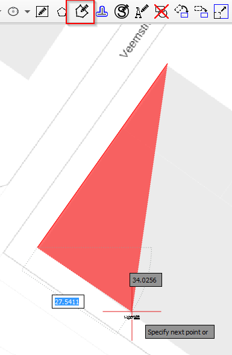

Door het links klikken op de kaart verschijnt de vorm van het vlak. Door met rechts te klikken verschijnen een aantal opties:

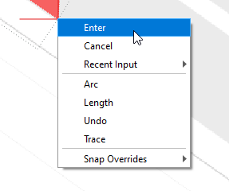

Met **Enter** wordt het tekenen van het vlak voltooid. *Cancel* stopt het tekenen van het vlak volledig. Met de optie *Arc* kan een boog worden toegevoegd aan het vlak en door control in te drukken keer je de richting van de boog om.

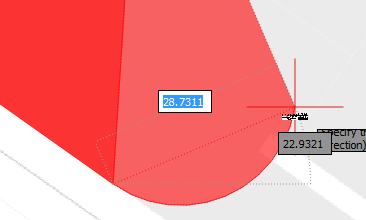

Tijdens het tekenen van de boog zijn er met rechts klikken ook weer extra opties beschikbaar, nu gerelateerd aan het intekenen van de boog:

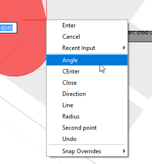

Met de opties **Length** kan een segment van een bepaalde lengte worden toegevoegd aan het vlak. 

De optie **Undo** verwijderd alleen het laatst getekende punt van het vlak maar annuleert niet het tekenen van het huidige vlak.

**Snap Overrides** geeft de mogelijkheid om tijdens het tekenen de snapping opties aan te passen.

In het menu van de QAD tekentool kan een selectie worden gemaakt waarop gesnapt moet worden:

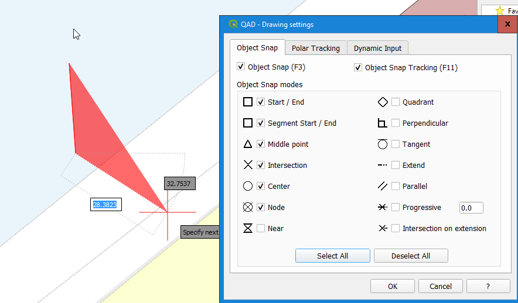

Met *Enter* of rechtermuisklik *Enter* kan het intekenen van de bouwlaag worden voltooid.

### Bouwlaag overnemen van BAG

Klik op de knop **Objecten selecteren per gebied of met een enkele klik**:

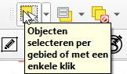

Selecteer de BAG laag in de lagenlijst:

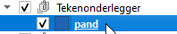

Selecteer het BAG vlak wat je als bouwlaag wil gebruiken:

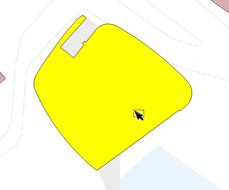

Klik op **Object kopiëren**:

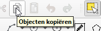

Selecteer de bouwlaag laag en kies objecten plakken:

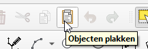

Nu is het BAG-vlak toegevoegd aan de laag bouwlaag:

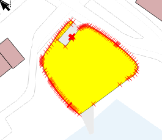

Sla altijd je wijzigingen op die je aan de laag hebt doorgevoerd:

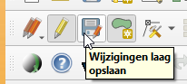

[start](index.md)

## Hulplijnen tekenen

Maak de kaartlaag **hulplijn** bewerkbaar in het lagenoverzicht. 

Bepaal de vorm die je wil intekenen en kies uit de volgende opties:

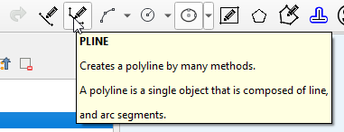

Met de optie **PLINE** teken je een hulplijn uit meerdere segmenten.