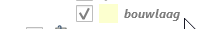

# Tekenen in QGIS

## Algemeen

QGIS werkt met net als andere GIS-systemen met (kaart)lagen. Iedere laag bevat altijd 1 soort geometrie: punten, lijnen óf polygonen (vlakken). Combinaties van geometrie soorten binnen 1 laag zijn dus niet mogelijk in GIS. Vandaar dat de verschillende tekenelementen zijn verdeeld over meerdere GIS-lagen. Iedere laag heeft zo zijn eigen eigenschappen en mogelijkheden. Onder tekenen wordt een combinate van toevoegen, bewerken en verwijderen van data verstaan. Doordat iedere laag zijn eigen opmaak heeft levert dat in combinatie met de data een beeld op. Alle lagen bij elkaar vormen het uiteindelijke beeld wat naar de eindgebruiker toe zichtbaar zal worden (bijv. MOI).

# QGIS Interface

De gebruikersinterface van QGIS heeft een aantal onderdelen die hier even kort worden toegelicht. Een volledige handleiding van QGIS vind je [hier](https://docs.qgis.org/3.16/en/docs/index.html).

## Lagen paneel

Het lagen paneel biedt een overzicht van de beschikbare kaartlagen. 


Onder het kopje tekenlagen vind je de bewerkbare lagen om bereikbaarheidskaarten in te tekenen.


Deze lagen zijn gegroepeerd per type bereikbaarheidskaart, zoals bijvoorbeeld een OIV object of een evenement. Daarnaast is het direct mogelijk om de uitvoer richting de MOI te bekijken door te klikken op MOI preview. Dezelfde service wordt dan getoond in QGIS die ook in de MOI of andere applicaties wordt gebruikt.

# Tekenen

## Bewerkbaar maken

In QGIS zijn de lagen beveiligd tegen onbedoeld bewerken. Dus om te kunnen tekenen in QGIS moet de laag die je wil bewerken eerst op 'bewerkbaar' gezet worden. Klik daarvoor eerst op de betreffende laag in het lagenoverzicht aan de linkerzijde, bijvoorbeeld bouwlaag:



 en dan op het potlood icoon in de werkbalk bovenin.


Voor de laagnaam verschijnt nu ook een potlood icoontje om aan te geven dat de laag bewerkbaar is. De huidig geselecteerde laag wordt verder aangeduid door een blauwe achtergrond bij klikken op de laag en een grijze achtergrond wanneer je op de kaart bezig bent maar wanneer de kaartlaag nog wel geselecteerd is (lagen paneel buiten focus).


De bewerksessie is pas weer afgesloten zodra je weer in de werkbalk op het poltlood icoontje klikt en de wijzigingen worden pas daadwerkelijk opgeslagen zodra er wordt geklikt op **Wijzigingen laag opslaan**.

```tip
Vergeet na het bewerken van een laag niet de wijzigingen op te slaan met de knop **Wijzigingen laag opslaan**
```

## Tekenhulpmiddelen

### Snappen

Met snappen kun je punten, lijnen en vlakken precies laten aansluiten op bestaande tekeningen.

Het snappen kan worden aangezet met het magneet icoon waarna in het menu gekozen kan worden waarop moet worden gesnapt en met welke nauwkeurigheid:


```note
Snappen werkt niet op basiskaarten (ondergrondraster lagen)
```

### Geavanceerd digitaliseren 

Met geavanceerd digitaliseren is het mogelijk om nauwkeuriger te tekenen. Hiermee kunnen lijnen exact parallel of onder een specifieke hoek (loodrecht of iedere andere hoek) geplaatst worden. Ook is het mogelijk om direct de coördinaten van het volgende te plaatsen punt in te voeren.


Met het paneel geavanceerd digitaliseren geopend zie je het volgende:


Sneltoetsen:

```
d: afstand vastleggen
a: hoek vastleggen
x: x-coördinaat vastleggen
y: y-coördinaat vastleggen
c: constructiemodus
p: loodrecht of parallel tekenen
```

Met de constructiemodus kan je meten en punten op de kaart klikken ter referentie, ze worden niet toegevoegd aan het te tekenen object. Met sneltoets **c** kan je snel wisselen tussen schetsen/hulppunten en punten plaatsen.


## Vlakken tekenen

Begin het tekenen van een vlak met **Object polygoon toevoegen**:


De muis cursor veranderd in een crosshair en je kunt op de kaart klikken om het vlak te maken.


Druk op **OK** om het vlak te plaatsen. De wijzigingen worden nu lokaal toegevoegd.

## Lijnen tekenen

De muis cursor veranderd in een crosshair en je kunt op de kaart klikken om de lijn te maken. Rechtermuisklik om de lijn te plaatsen en de attributen te vullen.  Druk op **OK** om de lijn te plaatsen. De wijzigingen worden nu lokaal toegevoegd.

## Punten tekenen

De muis cursor veranderd in een crosshair en je kunt op de kaart klikken om het punt te plaatsen. Na het plaatsen opent het formulier om de attribuutwaarden te vullen. Druk op **OK** om het punt te plaatsen. De wijzigingen worden nu lokaal toegevoegd.
